### Due to some technical issue, i am not able to upload video, that's why i am adding screenShots of the application

## HomePage
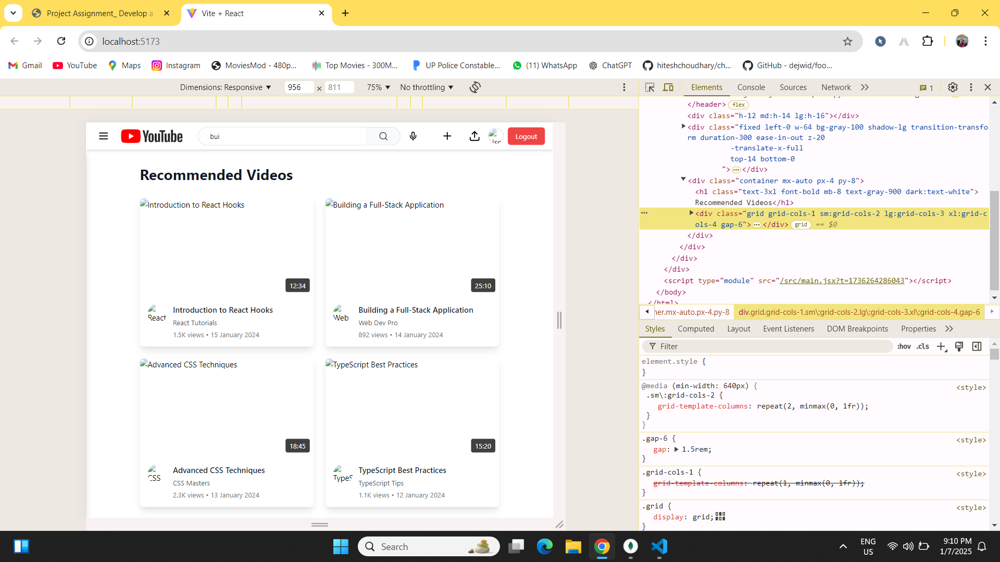
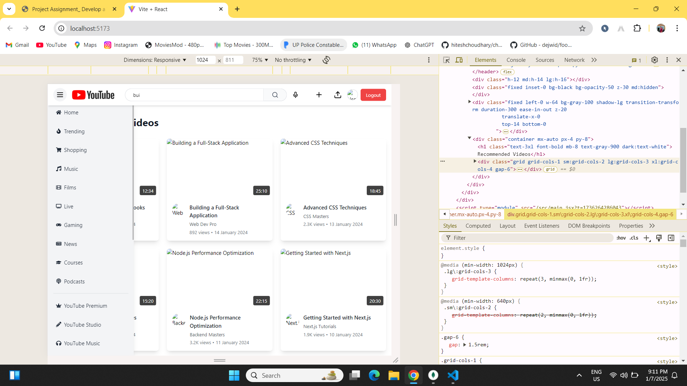

## LoginPage
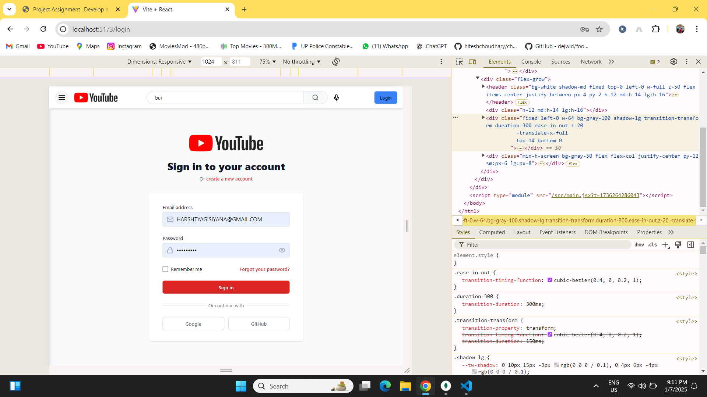

## RegisterPage
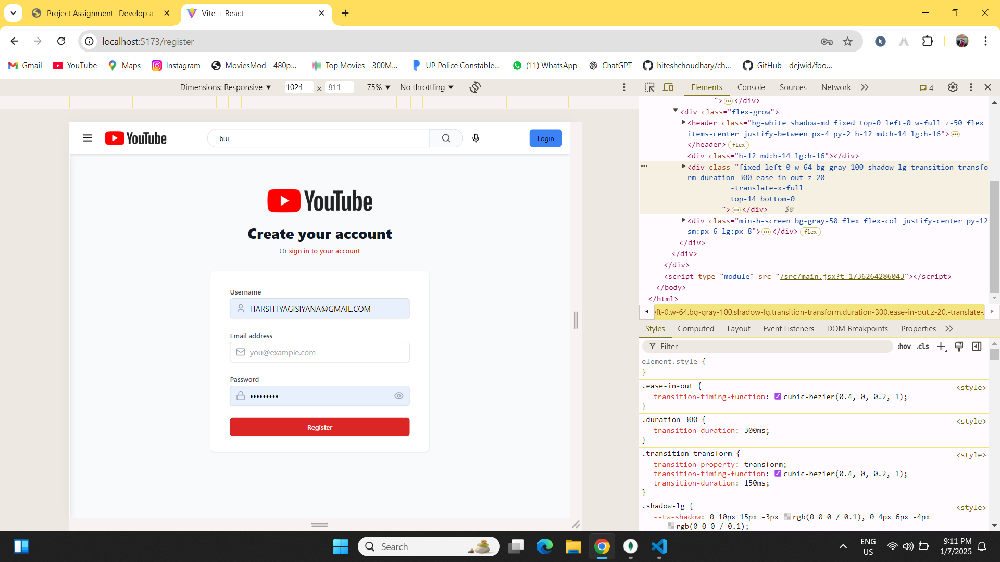

## ChannelPage
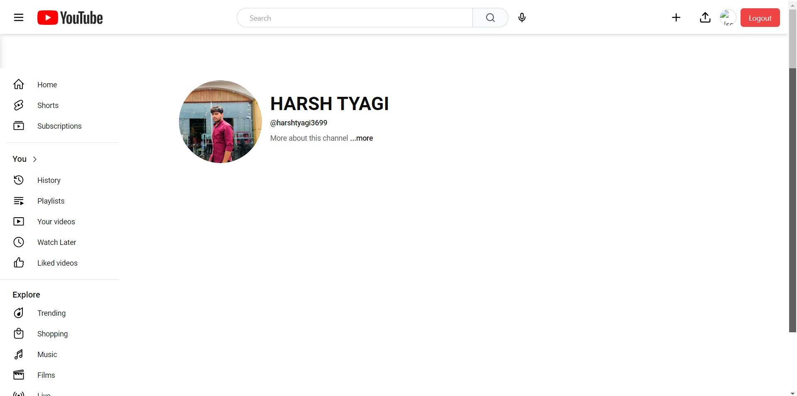
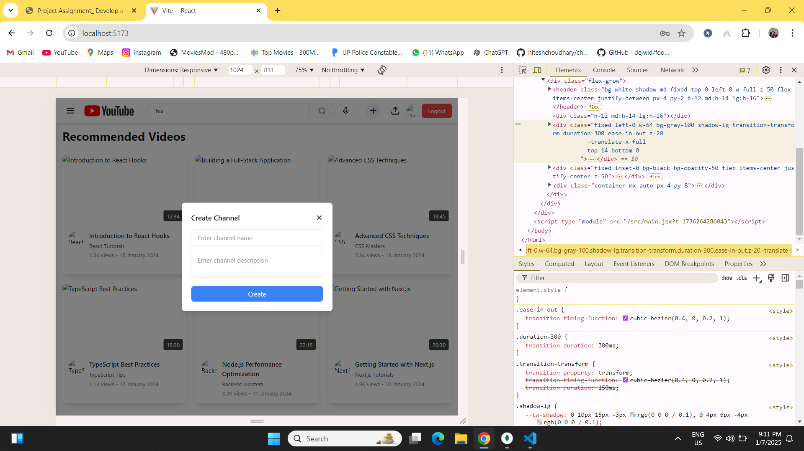

## videoForm
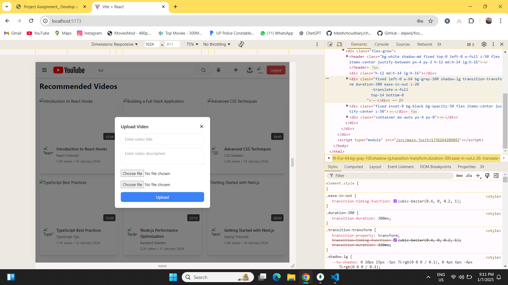

## videoPlayer
.png)

## commentSection


## error HomePage
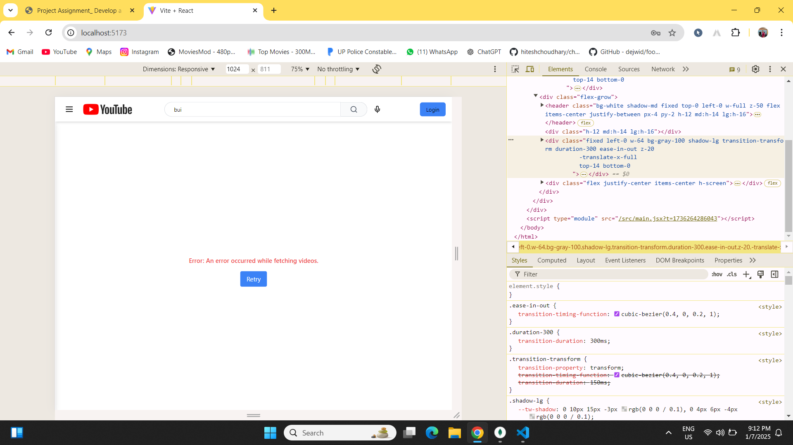

## Database collection
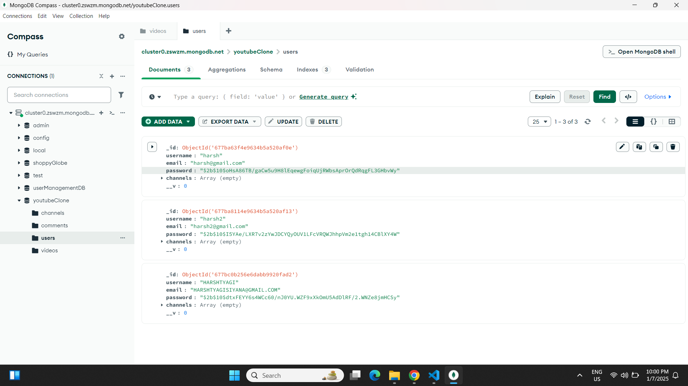
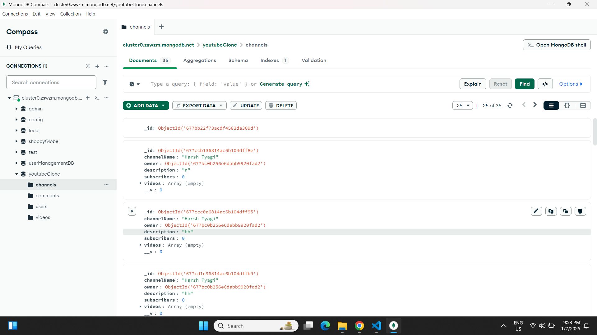
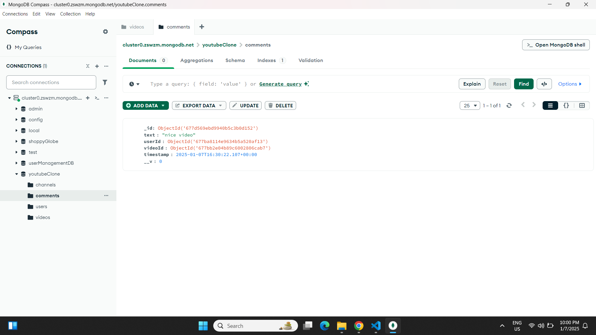
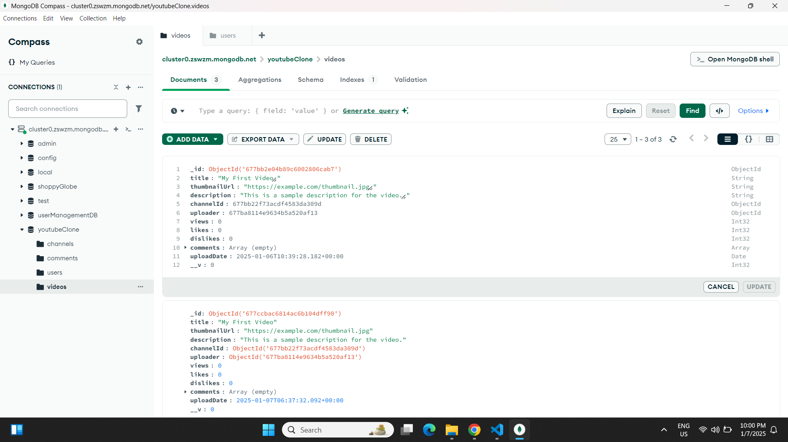

# YouTube Clone Using the MERN Stack

## Project Overview
This project involves the development of a full-stack YouTube clone using the MERN stack: MongoDB, Express.js, React.js, and Node.js. The application replicates core YouTube functionalities, allowing users to view, upload, and interact with video content.

---

## Features

### Frontend (React)
1. **Home Page**
   - Displays a YouTube-like header.
   - Includes a static sidebar that toggles via a hamburger menu.
   - Features filter buttons for categories.
   - Showcases a grid of video thumbnails, each containing:
     - Video title
     - Thumbnail
     - Channel name
     - Number of views

2. **User Authentication**
   - Users can register and log in with:
     - Username
     - Email
     - Password
   - Authentication is managed using JWT.
   - Displays user's name upon login.

3. **Search and Filter Functionality**
   - Search videos by title via a search bar in the header.
   - Filter videos by category using filter buttons.

4. **Video Player Page**
   - Displays the selected video with:
     - A video player
     - Title and description
     - Channel name
     - Like/dislike buttons
     - Comment section (users can add, edit, and delete comments).

5. **Channel Page**
   - Users can create a channel after signing in.
   - Displays all videos belonging to a specific channel.
   - Allows channel owners to edit or delete their videos.

6. **Responsive Design**
   - Fully responsive layout optimized for mobile, tablet, and desktop devices.

---

### Backend (Node.js & Express)
1. **API Endpoints**
   - **User Authentication**: Sign-up, login, and JWT-based authentication.
   - **Channel Management**: Create, edit, and fetch channel details.
   - **Video Management**: Add, fetch, update, and delete videos.
   - **Comments**: Add, fetch, edit, and delete comments.

2. **Database (MongoDB)**
   - Collections:
     - Users
     - Videos
     - Channels
     - Comments
   - Stores metadata for videos, including URLs and thumbnails.

---

## Technologies Used
### Frontend
- React.js
- React Router
- Axios
- CSS (Responsive Design)

### Backend
- Node.js
- Express.js
- MongoDB (MongoDB Atlas)

### Authentication
- JSON Web Tokens (JWT)

### Version Control
- Git

---

## Setup Instructions

### Prerequisites
1. Node.js and npm installed.
2. MongoDB Atlas account or local MongoDB instance.
3. Git installed.

### Steps
1. **Clone the Repository**
   ```bash
   git clone <repository-url>
   cd youtube-clone
   ```

2. **Install Dependencies**
   - For the backend:
     ```bash
     cd backend
     npm install
     ```
   - For the frontend:
     ```bash
     cd ../frontend
     npm install
     ```

3. **Setup Environment Variables**
   - Create a `.env` file in the backend directory with the following:
     ```
     MONGO_URI=<your-mongodb-connection-string>
     JWT_SECRET=<your-jwt-secret>
     ```

4. **Run the Application**
   - Start the backend server:
     ```bash
     cd backend
     npm start
     ```
   - Start the frontend server:
     ```bash
     cd ../frontend
     npm start
     ```

5. **Access the Application**
   - Open your browser and navigate to `http://localhost:3000`.

---

## Directory Structure

### Frontend
```
frontend/
|-- src/
    |-- components/
    |-- pages/
    |-- context/
    |-- utils/
    |-- App.js
    |-- main.js
```

### Backend
```
backend/
|-- controllers/
|-- models/
|-- routes/
|-- middleware/
|-- utils/
|-- server.js
```

---

## Sample Data
### Video Data
```json
{
  "videoId": "video01",
  "title": "Learn React in 30 Minutes",
  "thumbnailUrl": "https://example.com/thumbnails/react30min.png",
  "description": "A quick tutorial to get started with React.",
  "channelId": "channel01",
  "uploader": "user01",
  "views": 15200,
  "likes": 1023,
  "dislikes": 45,
  "uploadDate": "2024-09-20",
  "comments": [
    {
      "commentId": "comment01",
      "userId": "user02",
      "text": "Great video! Very helpful.",
      "timestamp": "2024-09-21T08:30:00Z"
    }
  ]
}
```

### User Data
```json
{
  "userId": "user01",
  "username": "JohnDoe",
  "email": "john@example.com",
  "password": "hashedPassword123",
  "avatar": "https://example.com/avatar/johndoe.png",
  "channels": ["channel01"]
}
```

---


## Contributors
Harsh Tyagi

